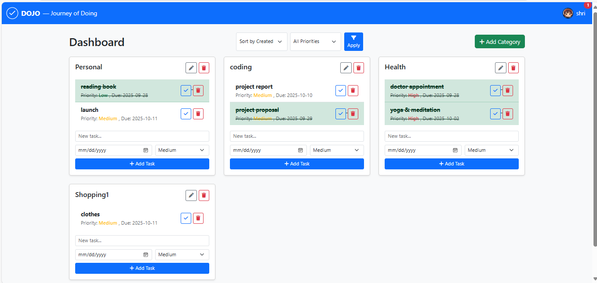
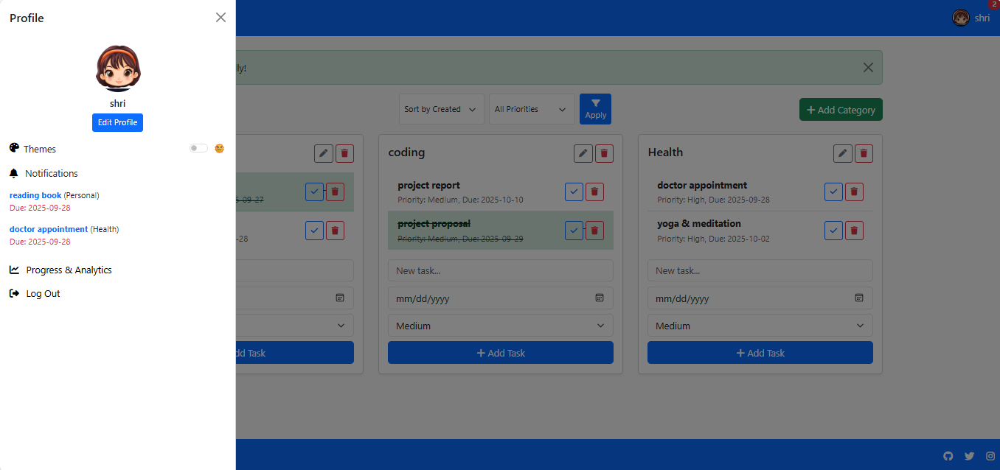
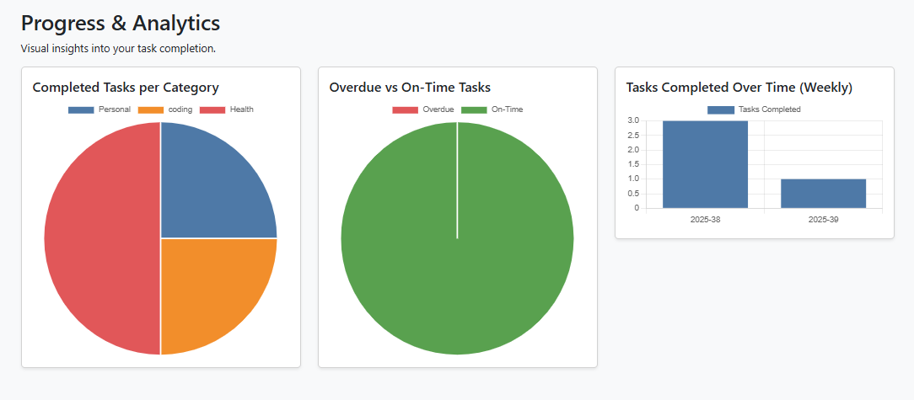

# DOJO – Journey of Doing

A full-stack task management web app built using Flask and MongoDB.

## Features
- User Authentication
- Task Categories
- Priority Management
- Notifications
- Dark/Light Theme
- Progress Analytics

## Technologies Used
- Flask
- MongoDB
- HTML
- CSS
- JavaScript
- Bootstrap
- Chart.js

## Screenshots

### Login Page

### Dashboard

### Profile Panel

### Progress Analytics

## Author

**Shrishti Vishwakarma**  
Final Year B.Sc Computer Science Student  
DOJO – Journey of Doing(Task management web app) 
